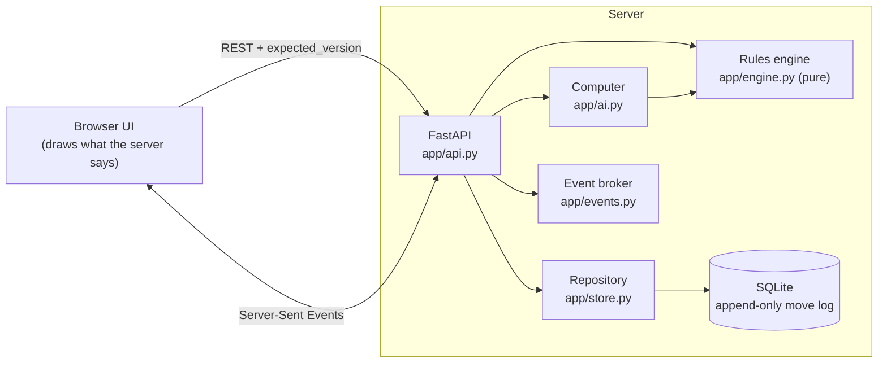

<h1 align="center">Tic-Tac-Toe, with a real backend</h1>

<p align="center">
  A rules engine that owns every move, a SQLite move log that never forgets,<br>
  live two-player games over SSE, and a computer opponent that can't lose.
</p>

<p align="center">
  <a href="https://github.com/Harsh-Dhingra/Open-Hands-Take-home/actions/workflows/ci.yml"></a>
  
  
  
  
  
</p>

<!-- MEDIA: add a screenshot or GIF here, e.g.
<p align="center"></p>
-->

> 🎥 **Screen recording:** _link goes here_ &nbsp;·&nbsp; 📸 **Screenshots:** see [Screenshots](#-screenshots)

---

## 🚀 Quick start

**You need:** [`uv`](https://docs.astral.sh/uv/) (it fetches Python 3.12 for you) and `make`. On macOS: `brew install uv`; elsewhere: `curl -LsSf https://astral.sh/uv/install.sh | sh`.

```bash
git clone https://github.com/Harsh-Dhingra/Open-Hands-Take-home.git
cd Open-Hands-Take-home

make install     # creates .venv and installs everything from uv.lock
make run         # starts the server on http://localhost:8000
```

Then open **http://localhost:8000** and press **New game**.

| You want to… | Do this |
|---|---|
| Play a friend | Press **New game**, then open the **share link** in a second tab (that tab plays O). Moves appear live in both. |
| Play the computer | Set **Opponent → Computer**, pick **Easy / Medium / Hard**, and choose X or O (choose O and the computer opens). |
| Try a bigger board | Set **Rows / Columns / In a row** (3–20) before pressing **New game** (human games only). |
| Explore the API | Open **http://localhost:8000/docs** (interactive OpenAPI). |

```bash
make test        # whole suite: 526 tests, ~30 s, fails below 85% coverage or <100% on the engine
make lint        # ruff check + format check
```

<details>
<summary><b>Settings and troubleshooting</b></summary>

| Variable | Default | Meaning |
|---|---|---|
| `PORT` | `8000` | Port for `make run` (e.g. `PORT=8080 make run`) |
| `DB_PATH` | `./tictactoe.db` | SQLite file; created on first start, safe to delete to start fresh |
| `SSE_KEEPALIVE_SECONDS` | `5` | Keepalive / re-read interval of the live event streams |

`.env.example` lists them (no secrets are needed anywhere).

- **"Address already in use"** → another program has the port: `PORT=8080 make run`.
- **Start clean** → stop the server and `rm tictactoe.db*`.
- **Older database** → it is upgraded automatically on startup (two nullable columns are added); existing games keep working.
- **Server won't stop on Ctrl-C** → `make run` already passes `--timeout-graceful-shutdown 3`, so open live streams cannot hold it up for long.

</details>

---

## 🧠 How it works



- **A game *is* its move log.** Board, status, winner and winning line are never stored: they are always **derived by replaying the moves** through the engine. State can't disagree with history, restarts can't change a game, and replay, concurrency and the AI all reuse one model.
- **The engine is pure** (no I/O): turns, bounds, occupancy, win and draw detection for any N×M board with K in a row. Every other layer asks it; nothing else knows a rule. The browser knows none at all.
- **Every move is one atomic step.** The repository runs "load → apply → save" inside a single `BEGIN IMMEDIATE` transaction, so racing requests can't corrupt a game.
- **Optimistic concurrency.** A move may carry the `expected_version` the client last saw; if the game moved on, the server answers `409 stale_version` (with the current version) and changes nothing.
- **Stable error codes:** `cell_taken`, `not_your_turn`, `game_over`, `out_of_bounds`, `invalid_config`, `stale_version`, `validation_error`, `not_found`.

### A 30-second API tour

```bash
# create a game, then move (X first); every response has board, next_player, status, version
curl -s -X POST localhost:8000/games
curl -s -X POST localhost:8000/games/<id>/moves -H 'content-type: application/json' \
     -d '{"player":"X","row":1,"col":1,"expected_version":0}'

# play the computer (O opens as X when you pick O); its reply is in the same response
curl -s -X POST localhost:8000/games -H 'content-type: application/json' \
     -d '{"opponent":"computer","difficulty":"hard","human_plays":"O"}'

# watch a game live
curl -N localhost:8000/games/<id>/events
```

Full API reference and more examples: **[docs/DETAILS.md](docs/DETAILS.md)**.

---

## ✨ Beyond the requirements

I picked the extras that stress the state model hardest, instead of polish. Each is a small step on the same move-log idea, which is why they stayed cheap to test:

| Extra | What you get | How it's proven |
|---|---|---|
| **Any board, any K** | 3×3 up to 20×20, K in a row, wins in all four directions | every possible line on six rectangular boards; random games checked against an independent brute-force scan |
| **Survives restarts + replay** | Games and full move history persist; `GET /games/{id}/moves` replays them | server killed with `SIGTERM` and `kill -9` mid-game, state identical afterwards |
| **Two clients, safely** | Optimistic concurrency, plus live updates over SSE (polling only as a fallback) | 20 racing requests apply exactly one; separate games never interfere |
| **Computer opponent** | **Easy** (random), **Medium** (win, else block, else random), **Hard** (minimax, never loses) | Hard compared with an independent oracle in all 4,520 playable positions; every possible opponent line enumerated, as X and as O |

---

## 🧪 Testing

**526 tests, 100% line + branch coverage**, and `make test` enforces a hard 100% gate on the rules engine.

- **Exhaustive over guessing:** the computer is checked in *every reachable position* (5,478), not in hand-picked ones.
- **Mutation checks:** I deliberately broke the code (dropped a direction, removed a check, flipped min/max…) to confirm a test notices; the survivors showed real gaps.
- **Real systems, not mocks:** a temp SQLite file for storage and races, a real `uvicorn` subprocess for restarts (`SIGTERM`, `kill -9`) and live streams, and the real UI driven in a browser.

## 🗂 Repository layout

```text
app/
  engine.py     pure rules: turns, validation, win/draw, staleness, legal moves
  ai.py         Easy / Medium / Hard policies and the "human move + reply" turn
  store.py      repository interface, in-memory + SQLite (move log, migration)
  events.py     per-game broker and the SSE stream
  limits.py     supported board sizes and defaults
  models.py     request / response schemas
  api.py        FastAPI routes and error mapping
  static/       the web UI (plain HTML, CSS, JS; no build step)
tests/          unit, API, storage, concurrency, restart, SSE and AI suites
docs/           DETAILS.md (API reference and notes) and media/
Plan.md         scope, architecture, milestones (written before the code)
```

---

## 📸 Screenshots

<!-- Replace each line with a real file under docs/media/ (png, gif or mp4 links):
| Playing a friend | Playing the computer | Big board |
|---|---|---|
|  |  |  |
-->

_Screenshots and the recording will be added here._

---

## 🤖 AI tools

I used **Claude Code** (Claude Sonnet 5.5) in the Claude desktop app, working **plan first**: it drafted `Plan.md` (scope, architecture, milestones, test strategy) and a short plan for each feature, which I approved or changed before any code, then built one milestone per branch in small commits (`git log` shows the order). To review its output I leaned on **mutation checks**, **exhaustive and oracle-based tests** instead of hand-picked cases, and driving the **real UI in a browser**; several real bugs were found that way and fixed (a database startup race, event streams that leaked on disconnect, a server that would not shut down with open streams, a flaky test harness), and each is described in its commit message.

## 🔧 What didn't go as planned / what I'd improve with more time
The scope grew beyond my initial estimate, so I left replay and Docker support in the backlog.
Computer replies introduced a duplicate-request risk; requiring the expected game version prevented unintended extra moves.
Database startup and streaming tests exposed a locking issue and test flakiness, both addressed during iteration.
With more time, I’d automate browser checks for all difficulty levels, stale-board recovery and reconnect behavior.

